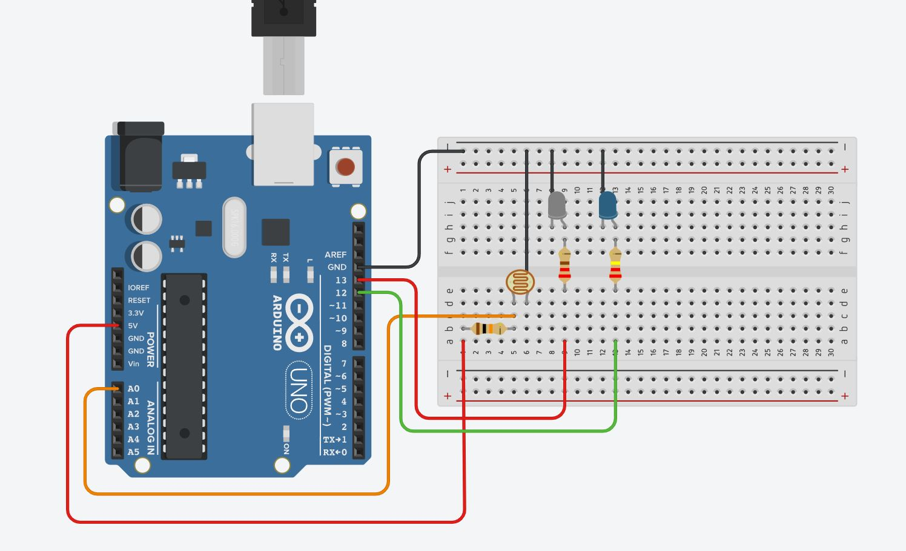

# Projeto Arduíno para manipular um sensor de luminosidade

## Contextualização

Neste experimento fiz com que o dois LEDs incorporados acendam separadamente de acordo com o sensor de presença. 

## Lista de componentes:

– Arduíno UNO R3
– Um cabo de conexão USB
– Placa de prototipação (Protoboard)
– LED
– Resistor de 220 Ω ohms
– Resistor de 10k Ω ohms
– Fotoresistor (Sensor de luminosidade) LDR
– Jumpers (macho-macho)

## Esquema do projeto

## Projeto no Tinkercad

https://www.tinkercad.com/things/1XrqkoqBrCH

